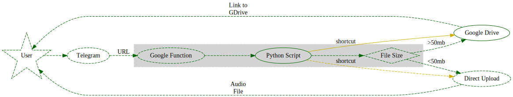

# u2ber
Downloading audio from online video on the go. For example: you are watching some music on popular website and you like the music there - share this link with this app and receive back an audio file which you can listen at any point of time. 

# How does it work (will work)



Telegram is popular messaging system, but in addition it has an open API and wide possibilities for integrations and [bots](https://core.telegram.org/bots).

You can use a lot of different server side listeners and trigger actions on your side, but for this "home" project, I don't want to use any clients or permanently running application. Serverless should be the best way to go with low usage (most of the time no actions will be in place at all).

Google Cloud has [Cloud Functions](https://cloud.google.com/functions) (similar to AWS Lambda). Plus Google is giving $300 bonus right now for testing their cloud solutions.

Each Cloud Function can be triggered internally (by [scheduler](https://cloud.google.com/scheduler)), but [pub/sub](https://cloud.google.com/pubsub/docs) or by triggering unique URL for that specific function.

And I'm planning to use URL since Telegram Bot can trigger URL via [webhooks](https://core.telegram.org/bots/api#setwebhook).

Message back to the original chat will be passed via direct [sendAudio](https://core.telegram.org/bots/api#sendaudio) message, which will allow to listen to the audio right in the Telegram or download it to the device. SendAudio has a limit of 50mb per file, for now will make is as exception, later will upload them to GoogleDrive (or Google Bucket) and will send direct link to it via Telegram Message. _Plus was thinking to create folder for each user to keep some settings there, such as quality of the audio (for now it will be maximum), log of errors or messages, plus all downloaded files, so user can quickly access them later._ 

Functions can be written on Python, Node.js and other languages. Will use Python 3.7 for this project.

# Downloading

Downloading script is taking link to any youtube video and providing file location and size:
```
$ ./u2ber_downloader.py --help
usage: u2ber_downloader.py [-h] [--url URL]

optional arguments:
  -h, --help  show this help message and exit
  --url URL   Link to Youtube video
```

Requirements:
```
$ pip install -r requirements.txt
```
or 
```
$ pip install --upgrade --force-reinstall "git+https://github.com/ytdl-org/youtube-dl.git"
```

# Uploading

Uploading script is taking Telegram User ID to keep files for each user separately on Google Drive, file to upload there. Plus all folders are stored in single root location which can be specified in parameters.
```
$ ./u2ber_uploader.py --help
usage: u2ber_uploader.py [-h] [--user_id USER_ID] [--file FILE] [--root ROOT]
                         [--config CONFIG]

optional arguments:
  -h, --help         show this help message and exit
  --user_id USER_ID  Telegram User ID for keeping files in separate folder
  --file FILE        Output file to upload to Google Drive
  --root ROOT        Root folder where other folders will be placed
```

# TODO:
1. [x] create Python local script with minimal scope
    1. [x] receive url
    1. [x] download file
    1. [x] provide audio file in highest quality 
1. [x] create Google Function
    1. [x] upload script
    1. [x] get public url
1. [ ] register Telegram-bot and setup webhook
1. [ ] add script for working with Telegram-bot
    1. [ ] parsing incoming variables, such as URL, sender and initial chat id to send the message back
    1. [ ] executing original script
        1. [ ] adaptation for Google Functions might be required
    1. [ ] sending message back
    1. [ ] add some help menu and error handlers (if original message is not recognized) 
